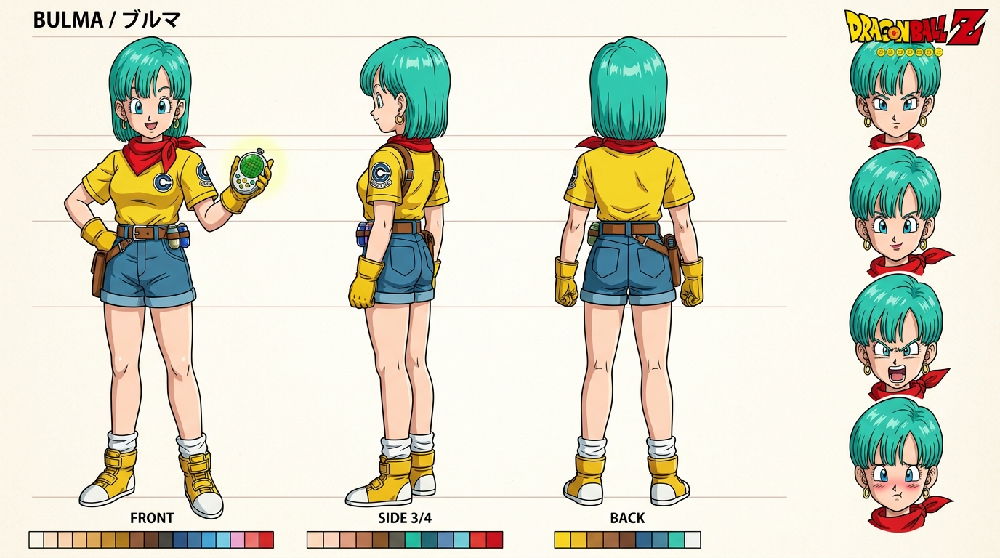
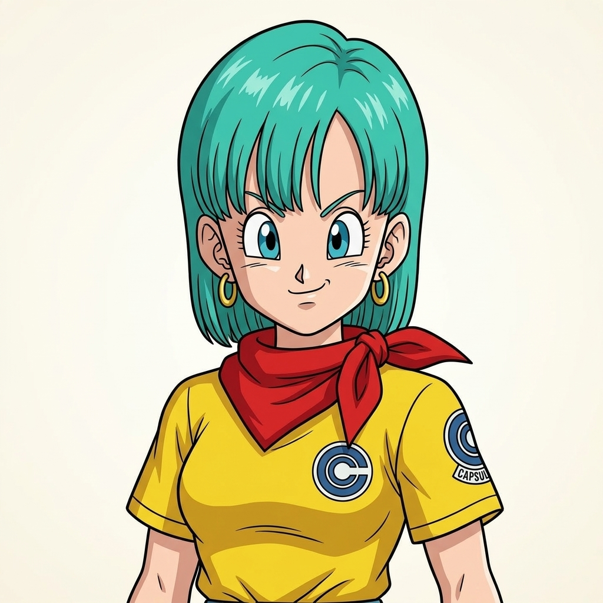
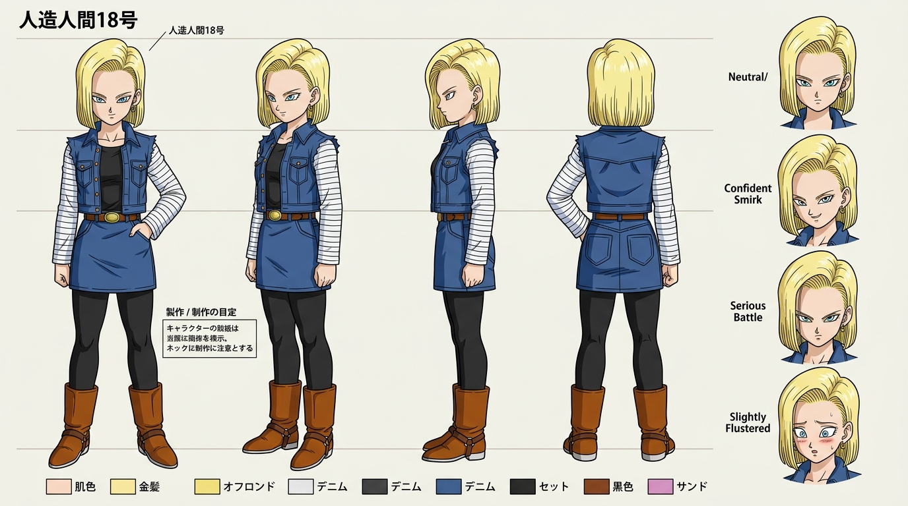
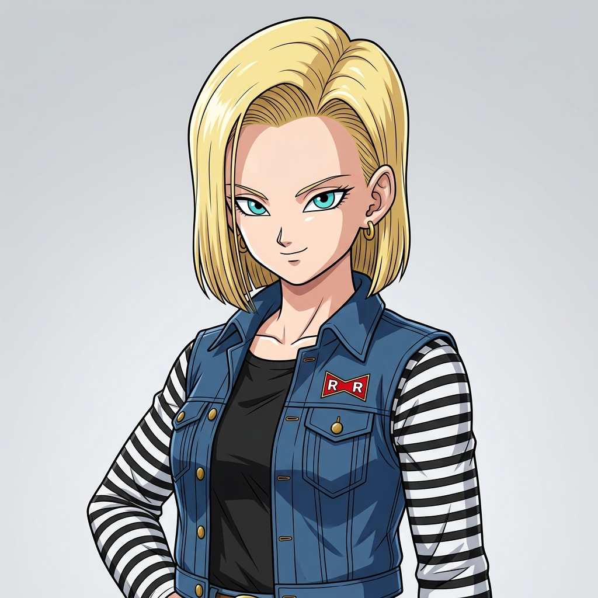
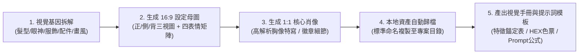

# 🎨 Anime Character Sheet Architect (動漫與虛擬角色設定集與三視圖架構師)

[](LICENSE)
[]()
[]()
[]()

專為動漫、漫畫、VTuber、同人創作與原創虛擬 IP 角色打造官方動畫級 **角色設定集（Character Model Sheet / Turnaround Sheet）** 與 **視覺特徵錨定系統** 的全方位工程化 AI 技能。

能將使用者的角色需求（經典 ACG 角色復刻或全新原創虛擬 IP），無縫轉化為具備**多角度全身迴轉視圖、四表情矩陣、標準 HEX 色票條、特徵錨定手冊與提示詞公式**的工業級資產，直接儲存於本地專案，作為後續生成 LINE 貼圖、社群頭像、分鏡插畫或 3D 模型的高保真一致性母檔。

---

## ⚡ 快速安裝（其他電腦一鍵安裝）

只要在任何安裝了 **Antigravity**、**Gemini CLI** 或 **Claude Code** 的電腦終端機中執行下列一行指令，即可直接安裝為全域技能：

### 🪟 Windows (PowerShell)
```powershell
irm https://raw.githubusercontent.com/JeffreyHo0520/anime-character-sheet-architect/main/install.ps1 | iex
```

### 🍎 macOS / 🐧 Linux (Bash)
```bash
curl -fsSL https://raw.githubusercontent.com/JeffreyHo0520/anime-character-sheet-architect/main/install.sh | bash
```

### 📦 手動 Git Clone 安裝
```bash
# 1. Clone 本專案
git clone https://github.com/JeffreyHo0520/anime-character-sheet-architect.git
cd anime-character-sheet-architect

# 2. 執行本機安裝腳本
# Windows:
powershell -ExecutionPolicy Bypass -File .\install.ps1

# macOS / Linux:
chmod +x ./install.sh && ./install.sh
```

---

## 📸 產出成果展示 (Showcase)

### 範例一：《七龍珠Z》布馬 (Bulma)
*鳥山明經典 90 年代東映賽璐璐手繪風格，水綠波波頭、膠囊公司亮黃上衣、紅領巾、七龍珠雷達與四款經典表情（冷靜自信、甜美微笑、憤怒吶喊、嬌羞嘟嘴）。*

#### 16:9 全方位角色設定母圖 (Turnaround Sheet)


#### 1:1 高解析核心肖像頭像 (Master Avatar)


---

### 範例二：《七龍珠Z》人造人18號 (Android 18)
*經典黑白斑馬紋袖、RR 紅領巾軍徽章牛仔背心、金黃齊肩短髮、四款表情與標準色票條。*

#### 16:9 全方位角色設定母圖 (Turnaround Sheet)


#### 1:1 高解析核心肖像頭像 (Master Avatar)


---

## 🎯 核心功能與設計價值

| 功能模組 | 規格與說明 |
| :--- | :--- |
| **視覺基因拆解 (Visual DNA)** | 深度解構髮型光澤、眼眸形狀、標誌性五官比例、服飾分層材質、隨身配件與角色氣場。 |
| **16:9 設定三視圖母圖** | 包含正身、3/4 側視、正側輪廓、背面視圖，搭配右側 4 款表情矩陣與底部標準色票條。 |
| **1:1 核心肖像大頭貼** | 半身/胸上高解析特寫，精確刻畫服飾配件徽章與眼神光芒，供社群頭像或 LINE 貼圖 Tab 使用。 |
| **本地資產自動歸檔** | 自動以標準規範名稱複製存入當前工作目錄：`<name>_character_sheet.jpg`、`<name>_avatar.jpg`、`character_reference_<name>.jpg`。 |
| **視覺特徵鎖定指南手冊** | 產出結構化 Markdown Artifact，提供特徵錨定表、HEX 色票代碼表與後續創作 Prompt 模板公式。 |

---

## 📋 5 步標準執行工作流程



1. **步驟 1：角色視覺基因深度拆解 (Visual DNA Breakdown)**
   - 迅速解構角色的身份背景、髮型髮色、眼眸形狀、服裝層次材質、隨身道具與目標大師畫風。
2. **步驟 2：調用生圖引擎生成 16:9 角色設定母圖 (Turnaround Sheet)**
   - 依標準動畫設定集構圖，呈現多視角全身迴轉、4 款表情矩陣與底部色票。
3. **步驟 3：生成 1:1 核心肖像頭像 (Master Avatar)**
   - 生成高解析胸上肖像，作為頭像、LINE 貼圖 Tab 圖標或主圖。
4. **步驟 4：自動複製歸檔至本地工作目錄**
   - 儲存為：
     - `<character_name>_character_sheet.jpg`
     - `<character_name>_avatar.jpg`
     - `character_reference_<character_name>.jpg`（供後續下游生圖管線精確錨定）
5. **步驟 5：產出角色視覺規範手冊 (Design Guide Artifact)**
   - 建立專屬 Markdown 手冊，包含特徵錨定表、色票代碼與填空式 Prompt 公式。

---

## 💬 如何在對話中呼叫使用

安裝完成後，在 Antigravity 或 Claude Code 中輸入以下指令或自然語言：

### 1. 斜線指令 (Slash Command)
```text
/anime-character-sheet-architect
```

### 2. 自然語言對話
- 「我要創造一個虛擬角色，是《七龍珠Z》布馬，請給我這個角色的角色設定圖」
- 「幫我做 [角色名稱] 的角色三視圖與表情矩陣設定集」
- 「請以 [作品風格] 幫我原創一個 [特徵描述] 的虛擬角色母檔」

---

## 🎨 經典動漫風格提示詞庫 (Style Cheatsheet)

| 作品風格 / 大師 | 核心提示詞 (Prompt Keywords) | 視覺特點 |
| :--- | :--- | :--- |
| **七龍珠 / 鳥山明** | `Akira Toriyama art style, 90s Dragon Ball Z cel-shading, sharp angular jawline, defined muscular contours, bold black line art` | 剛勁有力的黑線、鮮明塊狀高光與陰影、三角形鼻峰 |
| **海賊王 / 尾田榮一郎** | `Eiichiro Oda anime style, dynamic expressive eyes, fluid energetic linework, bold vibrant anime coloring` | 富有彈性的肢體線條、極誇張生動表情、高飽和色彩 |
| **火影忍者 / 岸本齊史** | `Masashi Kishimoto art style, classic Studio Pierrot animation, earthy ninja palette, soft cel shading` | 寫實手腳結構、精細忍具、自然柔和陰影漸層 |
| **咒術迴戰 / MAPPA** | `MAPPA modern anime aesthetic, cinematic lighting, sharp eye details with glossy iris highlights, dynamic high-contrast shadows` | 現代數位動畫光影、虹膜透明感、高對比冷色氛圍 |
| **京都動畫 (京阿尼)** | `Kyoto Animation aesthetic, delicate hair strands, soft gentle lighting, expressive warm eyes, detailed clothing folds` | 極致柔美髮絲、精巧五官、溫暖細膩空氣感 |

---

## 🔗 下游創作管線串接 (Ecosystem)

本技能產出之基準資產可無縫串接至：
- **LINE 貼圖套組**：直接以 `character_reference_<name>.jpg` 搭配 [`line-sticker-skills`](https://github.com/JeffreyHo0520/line-sticker-skills) 生成 8/16/24 款生活對話貼圖。
- **3D 盲盒公仔**：提取設定手冊中的色票與服飾細節，轉化為 3D 黏土/PVC Q 版公仔模型。
- **簡報與海報視覺**：搭配 [`universal-presentation-deck`](https://github.com/JeffreyHo0520/universal-presentation-deck) 或 Canva 海報設計技能。

---

## 📄 開源授權 (License)

本專案採用 [MIT License](LICENSE) 開源授權。
